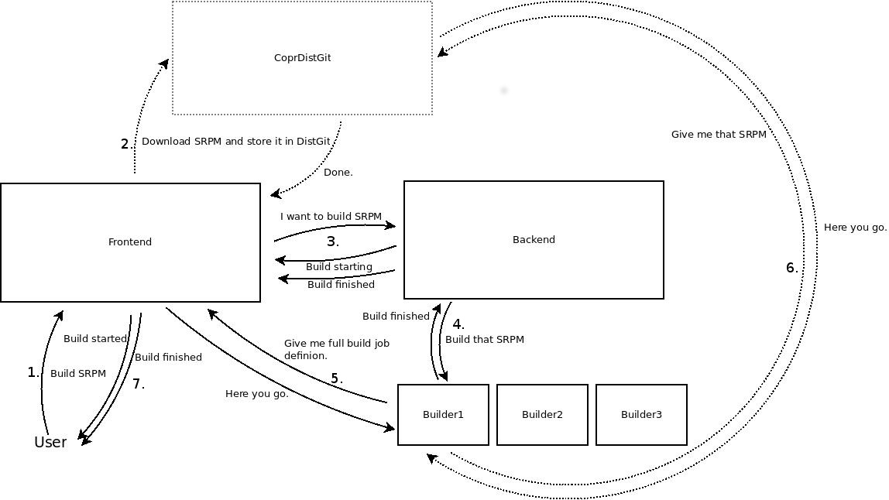

.. _developer_documentation:

Developer Documentation
=======================

This section contains information about developer topics. You may also be interested in :ref:`user_documentation` and :ref:`downloads`.

Source
------

Copr comes in several pieces. You can browse the source here:

* The source for Copr itself: https://pagure.io/copr/copr

Working with the code
---------------------

.. toctree::
   :maxdepth: 1

   How to install Copr as build service <how_to_install>
   Contribution, do you want to help us? <contribute>
   How to work with Git (the version control system for Copr project) <git_guide>
   Do you prefer sending patches? <patch_process>
   Building Copr packages (backend, frontend, ...) <building_package>
   Database schema <database_erd>
   Documentation of python code (or check copr-frontend-doc.rpm and copr-backend-doc.rpm) <http://miroslav.suchy.cz/copr/python-doc/>

History
-------

* `Origins <http://fedoraproject.org/wiki/Meetings:Kopers_IRC_log_20100324.2>`_

Misc
----

* :ref:`brainstorming`

* :ref:`seeddb`

SRPM URL/Upload build schema
----------------------------

Here is an example of how building process goes (for the simplest case of SRPM build) in COPR:

Note that we need to figure out whether CoprDistGit is actually still needed in the COPR architecture. That's why the lines are dotted there. It is still present in the current architecture though.

The backend design and diagrams
-------------------------------

.. toctree::
   :maxdepth: 1

   Build/action dispatcher <developer_documentation/dispatchers>
   WorkerManager principle <developer_documentation/worker_manager>
   Build process actions on backend <developer_documentation/builder_actions>

Integration tests
-----------------

* :ref:`sanity_tests`
