:orphan:

.. _screenshots_tutorial:

Screenshots tutorial
====================

This tutorial will briefly guide you through building first package.

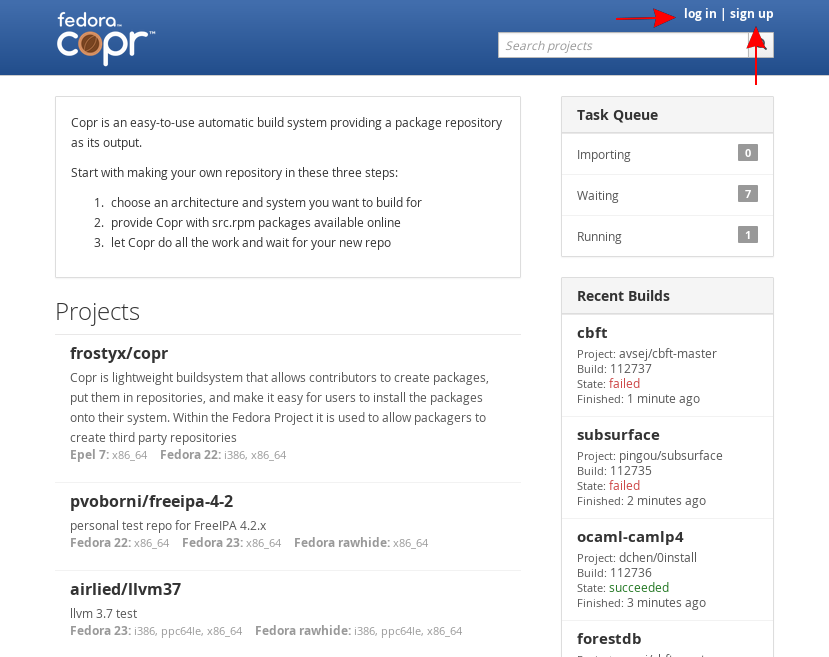

First you need to log in. Please use your FAS account. If you do not have FAS account yet, just click on "sign up" and you can create your FAS account for free and within one minute.

----

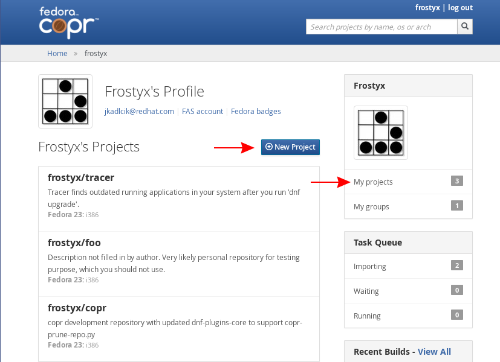

You can see field "My projects" and their number. And you can click on it to get list of your projects.

Right now there is probably zero. Lets create new project by clicking on "New Project" button.

----

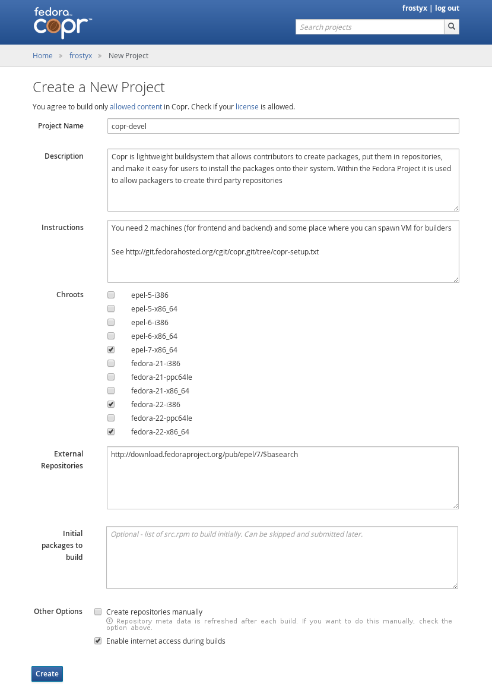

* Choose your project name. And choose wisely - it can not be changed later.

* Description is free form text, which is displayed together with project name to other users.

* Instructions should include how to install your package, where user get more information or which license your packages have.

* Chroots - for which architectures and distributions we should build your package.

* Repos - If you need additional repos (e.g. epel, jpackage), just list them here. This is passed to mockchain as option '--addrepo'. Each line is passed as is, so you can even use variables like $basearch or $releasever.

* Initial packages to build - if you want to submit some packages to build right now, you can. But lets skip it for now and submit them later.

Hit "Create" button.

----

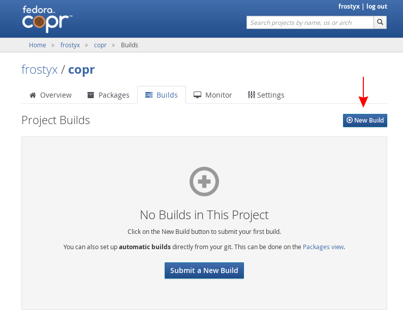

Click to "New Build" button under the "Builds" tab.

----

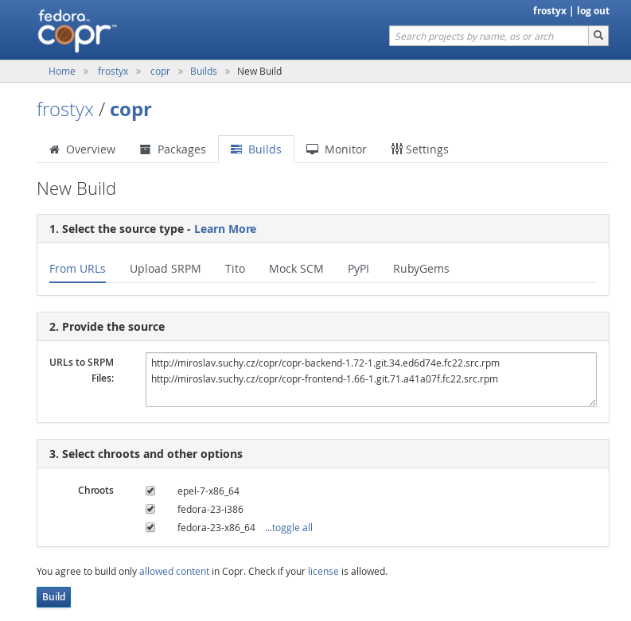

Enter url of your src.rpm files. This url must be accessible from internet. You can enter more packages at once, but be aware that build order of those packages are neither guaranteed nor sorted by build requires.

----

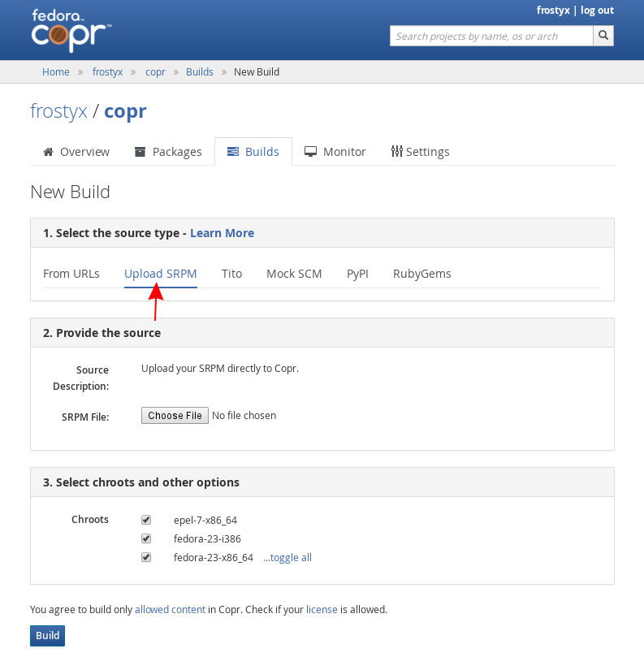

There is also possibility to upload src.rpm file directly from your computer, building package from your git repository with source code and spec file and many other ways to submit the build. You can choose a way that you like the most.

----

.. image:: _static/6-builds-running-failed-succeeded.png

You can see history and status of your builds in "Builds" tab. If you click on some row, you will see more details: from which src.rpm was that build and where are results.

----

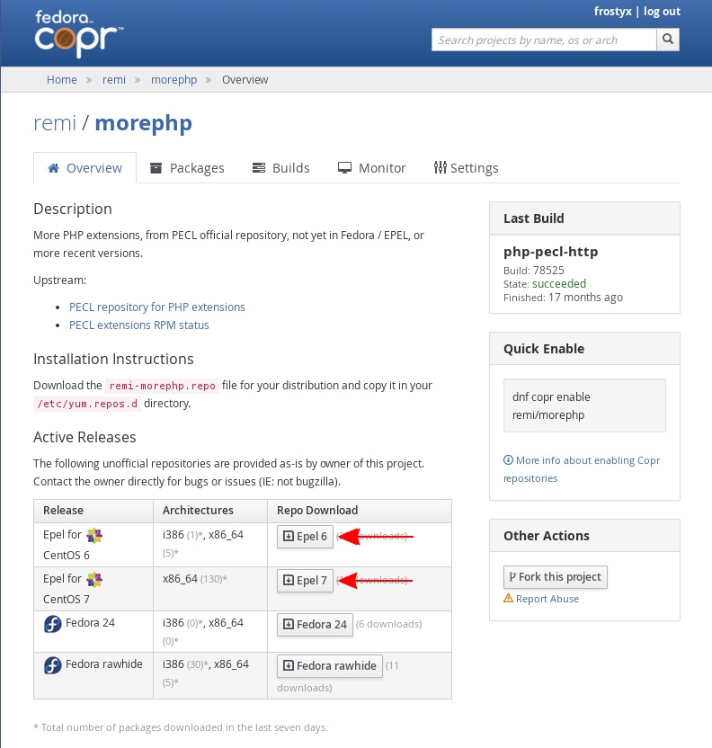

Once you have at least one build, on "Overview" tab are download buttons, which points to yum repo with your results. One repo file, for each distribution.

----

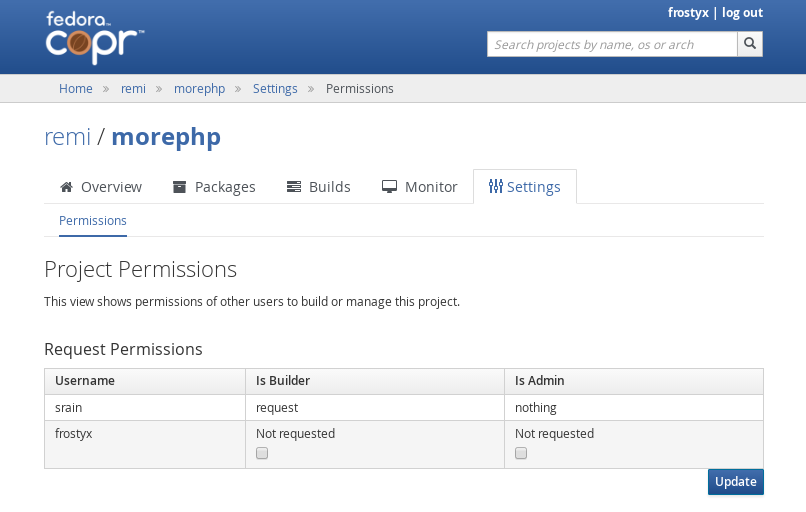

If you navigate project of somebody else (you can use search form on top of page), and open "Permissions" tab - you can request permissions for that projects. "Builder" can submit new builds, while "Admin" can give permissions to other people.

If owner or admin of this project then open "Permissions" tab, he can approve or reject this request.

Be aware that existence of new permissions request is not notified by email. This may change in future.

----

.. _chroot:

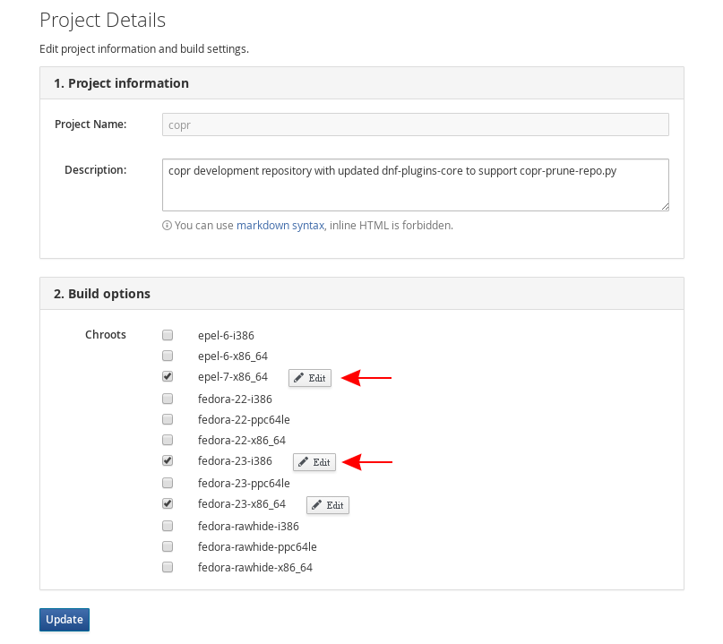

Beside each selected chroot (if you selected chroot for first time then you must submit this form first) is Edit link. This will get you to this page:

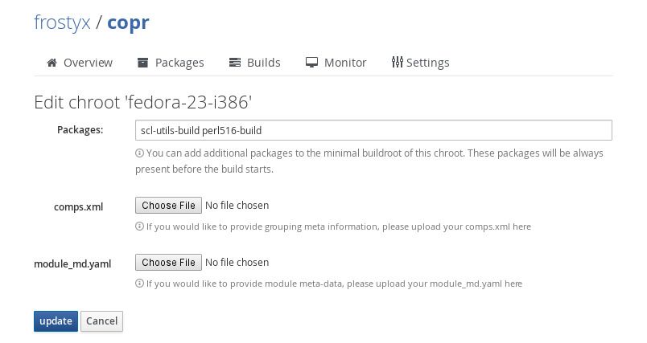

Where you can specify which packages should be always present in buildroot. This is crucial for building Software Collections.

You can specify packages which does not exist yet - such packages are ignored.

----

.. _monitor:

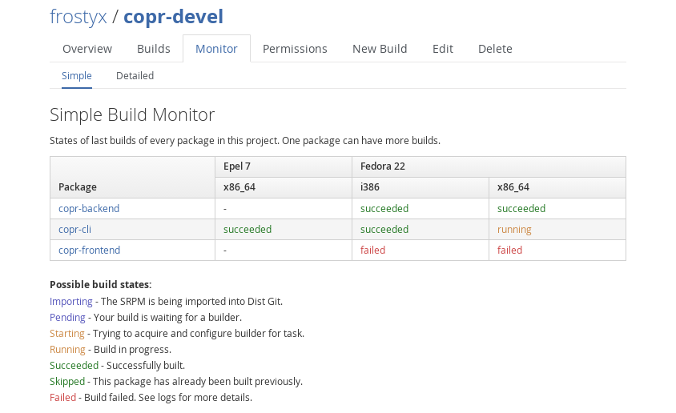

If you submitted several packages and you want to know current status, go to Monitor tab.
