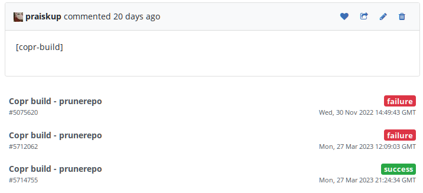
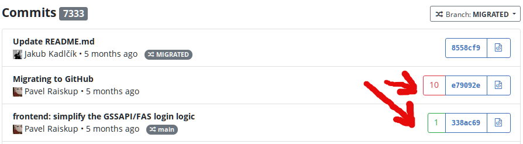

.. _pagure_integration:

Pagure Integration
------------------

You can configure Copr to do automatic builds for Pagure projects. Builds can be triggered by commits pushes
and/or newly opened pull requests.

Auto-rebuilding
^^^^^^^^^^^^^^^

To enable auto-rebuilding on push events, you need to set Fedmsg to 'active' in your project settings on Pagure
(in the 'Hooks' section). For some instances (e.g. `src.fedoraproject.org <http://src.fedoraproject.org/>`_), this
might already be active for all projects.

To enable triggering builds on PRs, on Pagure go to ``Settings`` -> ``Project Options`` and select the
``Fedmsg notifications`` option.

In Copr, you need an SCM or DistGit package definition. For SMC it may be as simple as specifying a public clone
URL of the remote Pagure repository, see :ref:`scm_ref` if you need more detailed settings. For :ref:`dist-git method`
choose desired DistGit instance and DistGit namespace. Also make sure, "Auto-rebuild" checkbox is checked.

From now on, you get automatic rebuilds for new pull-requests (including
force pushes), you can drop a comment with ``[copr-build]`` keyword to re-trigger the builds, and Copr also
automatically builds on pushes (commit) to the Pagure repo.

Note that pull request build results are placed into side directories, like ``<coprname>:pr:<pr_id>``. ``<pr_id>``
is ID of the pull request opened in Pagure. On Fedora, you can enable the side repository to test the
changes with:

::

    $ sudo dnf copr enable <ownername>/<coprname>:pr:<pr_id>

PR/commit flagging
^^^^^^^^^^^^^^^^^^

Above you configured a Pagure instance that auto-triggers Copr builds.
How to analyze the corresponding build results from the Pagure web UI?  You can
configure Copr to notify Pagure instance about the build results
using the "commit flagging" feature:

- Go to Pagure project settings, section "API keys", create a new API key, check for **'Flag a ...'** options, and copy it
- In Copr, go to **Settings->Integrations** and insert the copied API key into the second field in the "Pagure" section
- Into the first field, insert Pagure project URL that you can just copy from browser address bar if you are on the project homepage
- Click 'Submit' and you are done.

And that's it — whenever a new Copr build is triggered (by a Pagure event), Copr
lets the corresponding Pagure project know about the build status.  Example:

